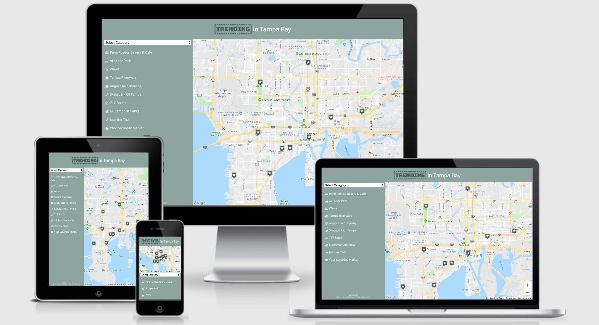
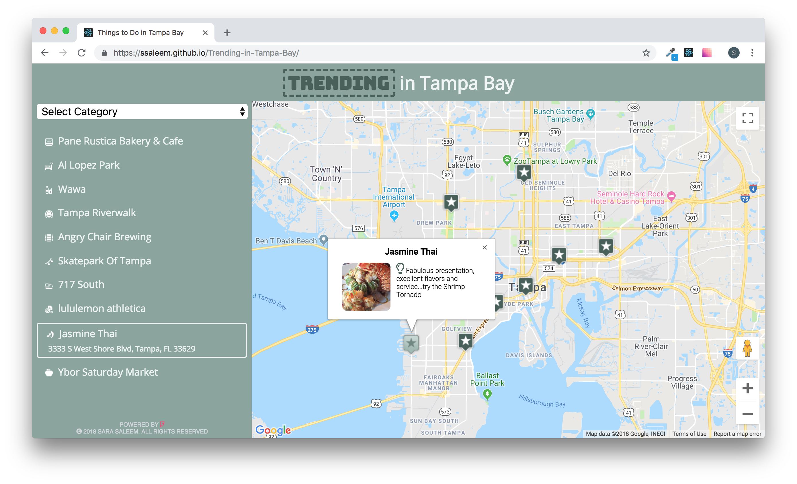
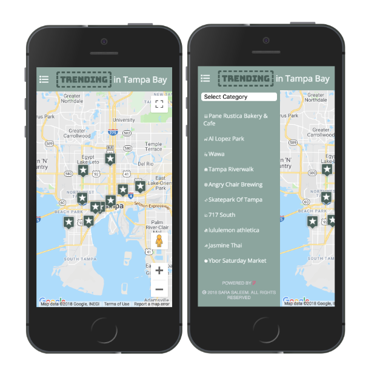
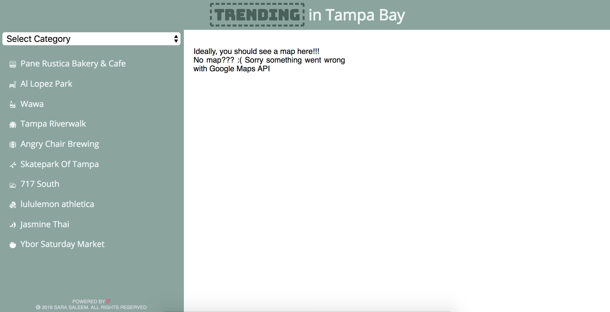
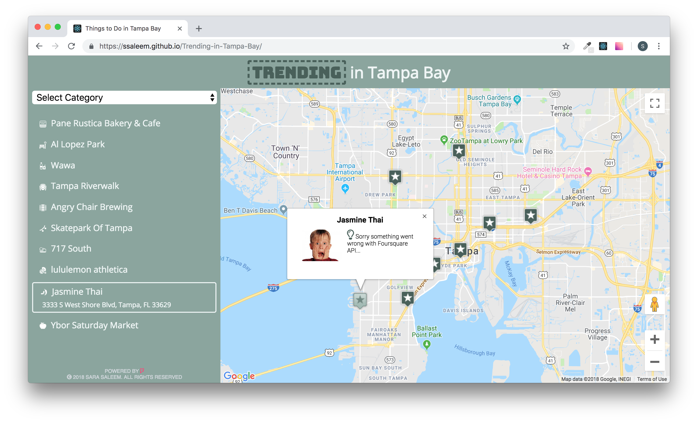

# Trending in Tampa Bay
A responsive Google Maps web application displaying top trending places at Foursquare in Tampa Bay area. The site also lists the places in a sidebar with the option to select/filter based on their type/catgeory.

## Contents
- [Features](#features)
- [Built with](#built-with)
- [Live Version](#live-version)

## Features

### UI Features 
- A map is loaded using the Google Maps API and displays map markers identifying top 10 trending places at Foursquare in Tampa Bay area. The app displays those locations by default when the page is loaded.
- A list view of the set of locations fetched from Foursquare is implemented.
- A dropdown filter option is implemented to filter both the list view and the map markers displayed by default on load. The list view and the markers update accordingly in real time.
- Selecting a location via list item or map marker causes the map marker to change its icon appearance. This indicates that the location has been selected, and an associated info window opens above the map marker with additional information feteched from Foursquare API.

### Responsive Design
The site is mobile-first and fully responsive. The sidebar listing all the places is hidden on smaller screens and a hamburger icon can be clicked to show or hide sidebar.

### Asynchronicity and Error Handling
All data from Google Maps and Foursquare API is loaded asynchronously, and errors are handled gracefully.
- For Google Maps API loading errors, a message is displayed that notifies the user that the data cannot be loaded so that there are no negative repercussions to the UI.

- The venue details displayed in marker info window, i.e, top photo and top tip submitted by users, are fetched through premium Foursqaure API calls. Foursqaure API Sandbox account allows only 50 premium calls per 24 hour period. This may result in `Foursquare Free Account Quota exceeded` error from Foursqaure API if the site is visited repeatedly on a day. To handle this error, a fallback photo and error notification is displayed in marker info window.

### Offline-first
- This project is bootstrapped with [Create React App](https://github.com/facebookincubator/create-react-app) which comes with a service worker and is used to serve assets from local cache. The service worker offering offline-first experience is enabled in the production build.

## Built with
- [React](https://reactjs.org/) - A JavaScript library for building user interfaces.
- [Create React App](https://github.com/facebookincubator/create-react-app) - Creates an environment to bootstrap React applications.
- [google-maps-react](https://www.npmjs.com/package/google-maps-react) - A declarative Google Map React component built using React.
- [Foursquare API](https://developer.foursquare.com/docs/api) - Api to incorporate Foursquare venues data as well as Photos, tips, and reviews written by Foursquare users into apps.
- [prop-types](https://www.npmjs.com/package/prop-types) - Runtime type checking for React props.
- [Fetch API](https://developer.mozilla.org/en-US/docs/Web/API/Fetch_API) - An interface for fetching resources.
- [CSS Flexbox](https://www.w3schools.com/css/css3_flexbox.asp) - CSS layout module to design flexible responsive layout structure without using float or positioning.
- [CSS Media Queries](https://www.w3schools.com/css/css3_mediaqueries.asp) - A popular technique to deliver a tailored style sheet to desktops, laptops, tablets, and mobile phones by defining different style rules for different media types.

## Live Version
The live version of this app can be explored [here](https://ssaleem.github.io/Trending-in-Tampa-Bay).

_Foursquare API free/Sandbox account has limited quota for requests made per 24 hours period, because of that Infowindow data may not be available if site is visited  multiple times_

<!-- ## How to run locally
To test the project without service worker.
- Install all project dependencies with `npm install`
- Start the application server with `npm start`

To see service worker in action
- Run `npm run build`
- Run `serve -s build`
- Navigate to `http://localhost:5000/` -->

